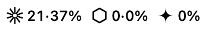
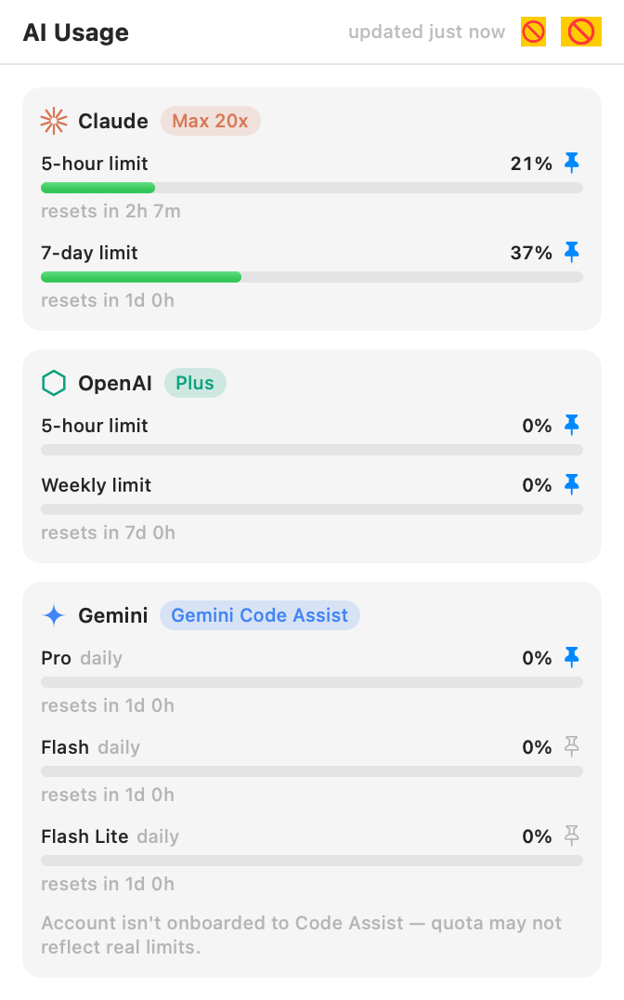

<div align="center">

<!-- Drop your logo at Assets/logo.png and it appears here -->


# AI Usage Monitor

**Your AI subscription limits, live in the macOS menu bar.**

Like iStat Menus, but for your Claude, OpenAI, and Gemini rate limits.






</div>

---

It reads the credentials your local CLIs are already signed in with — no API keys, no extra logins — and shows live usage for:

| Provider | Metrics | Source |
|---|---|---|
| **Claude** (Anthropic) | 5-hour and 7-day limits (plus per-model 7-day limits when reported) | Claude Code's OAuth token → the same endpoint as `/usage` |
| **OpenAI** (Codex) | 5-hour and weekly rate-limit windows, plan, credits | `~/.codex/auth.json` → the endpoint behind Codex's `/status` |
| **Gemini** (Google) | Per-tier daily quota (Pro / Flash / Flash Lite) | `~/.gemini/oauth_creds.json` → Code Assist quota API |

Everything runs locally. Tokens are read from where the CLIs store them, requests go directly to each provider, and nothing is logged or sent anywhere else.

## Features

- **Menu bar readout** — each provider appears as its logo glyph with its pinned percentages, e.g. `✳ 24·38%  ⬡ 0·0%  ✦ 0%`. Pin or unpin any metric from its row; unpin everything for an icon-only look. ⌘-drag to reposition.
- **Popover dashboard** — per-provider cards with color-coded usage bars (green → yellow → orange → red), plan badges (Max 20x, Plus, …), and live "resets in 2h 38m" countdowns.
- **Both windows, always** — Claude and OpenAI always show their 5-hour and 7-day/weekly windows (an unreported window means 0% used). Gemini shows daily windows — the only kind Google's quota API has.
- **Auto-refresh** — every 1/5/15/30 minutes plus refresh-on-open. Transient failures (including provider rate limits) keep the last good data on screen with a warning, and failed fetches retry automatically.
- **Launch at Login**, per-provider show/hide, graceful "not signed in" hints.

## Install

### From a release

1. Download the latest `AI-Usage-Monitor-x.y.z.dmg` from [Releases](../../releases).
2. Open it and drag **AI Usage Monitor** into **Applications**.
3. First launch: the app is not notarized, so **right-click the app → Open → Open**. (Or clear the quarantine flag: `xattr -d com.apple.quarantine "/Applications/AI Usage Monitor.app"`.)
4. If macOS asks for permission to read the **"Claude Code-credentials"** keychain item, click **Always Allow**.

### From source

Requires macOS 14+ and Xcode (Swift 5.9+).

```sh
git clone https://github.com/zachgodsell93/ai-usage-monitor.git
cd ai-usage-monitor
make install        # builds the .app, copies it to /Applications, and opens it
```

Other targets:

```sh
make check          # headless test: prints live usage for every connected provider
make dmg            # build the distributable disk image
make test           # unit tests
make run            # run the debug build without installing
```

## How it gets your usage

- **Claude** — Claude Code stores an OAuth token in the macOS Keychain (with `~/.claude/.credentials.json` as fallback). The app calls Anthropic's OAuth usage endpoint — the same one behind Claude Code's `/usage` — for 5-hour/7-day utilization and reset times. The app never refreshes this token itself; if it expires, open Claude Code once.
- **OpenAI** — the Codex CLI stores ChatGPT OAuth tokens in `~/.codex/auth.json`. The app calls the usage endpoint behind Codex's `/status`. Codex refresh tokens rotate server-side, so the app deliberately never refreshes them (that could log the CLI out) — run any `codex` command if the token expires.
- **Gemini** — the Gemini CLI stores Google OAuth credentials in `~/.gemini/oauth_creds.json`. Hourly access tokens are refreshed in memory using the CLI's own public OAuth client (read from your local gemini-cli install); nothing is written back. Quota comes from the Code Assist `retrieveUserQuota` endpoint.

## Privacy & safety

- Read-only: never writes to any CLI's credential store.
- Tokens never leave your machine except to the provider that issued them.
- No analytics, no third-party services. A local debug log of fetch outcomes (no tokens) is kept at `~/Library/Caches/AIUsageMonitor.log`.

## Troubleshooting

- **Claude shows "token expired"** — open Claude Code (`claude`) once; the next poll picks up the refreshed token.
- **Claude shows "rate-limited"** — Anthropic briefly rate-limits the usage endpoint after many requests; it recovers on its own.
- **OpenAI shows "not connected"** — run `codex login`.
- **Gemini shows "sign-in expired"** — run `gemini` and complete the Google login.
- **Gemini reads 0% forever** — consumer Google accounts lost Gemini CLI access in June 2026; the app flags this ("not onboarded to Code Assist"). Code Assist Standard/Enterprise accounts report real usage.
- **Can't find the menu bar item** — a crowded menu bar (many status items) can push items into macOS's hidden overflow. Remove/rearrange items (⌘-drag) to make room; the app requests a slot near the system icons on first launch.

## Releasing (maintainers)

Tag a version and push — GitHub Actions builds the DMG and attaches it to a release:

```sh
git tag v1.0.0 && git push origin v1.0.0
```

The release build is ad-hoc signed. For Gatekeeper-clean installs, add Developer ID signing + notarization to `.github/workflows/release.yml` (requires an Apple Developer account).

## Development

```sh
swift build && swift test
.build/debug/AIUsageMonitor --check                    # live end-to-end fetch, no UI
.build/debug/AIUsageMonitor --render-popover out.png   # render the popover to a PNG
.build/debug/AIUsageMonitor --render-label out.png     # render the menu bar label to a PNG
open "build/AI Usage Monitor.app" --args --self-test /tmp/st  # live-app self-test with window snapshots
```

Sources live under `Sources/AIUsageMonitor/`:

- `Services/` — one client per provider plus the polling `UsageStore`
- `Views/` — popover dashboard, provider logos, menu bar label
- `Support/` — HTTP/JSON helpers, timeout/timestamp utilities, Keychain access
