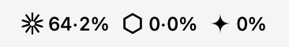
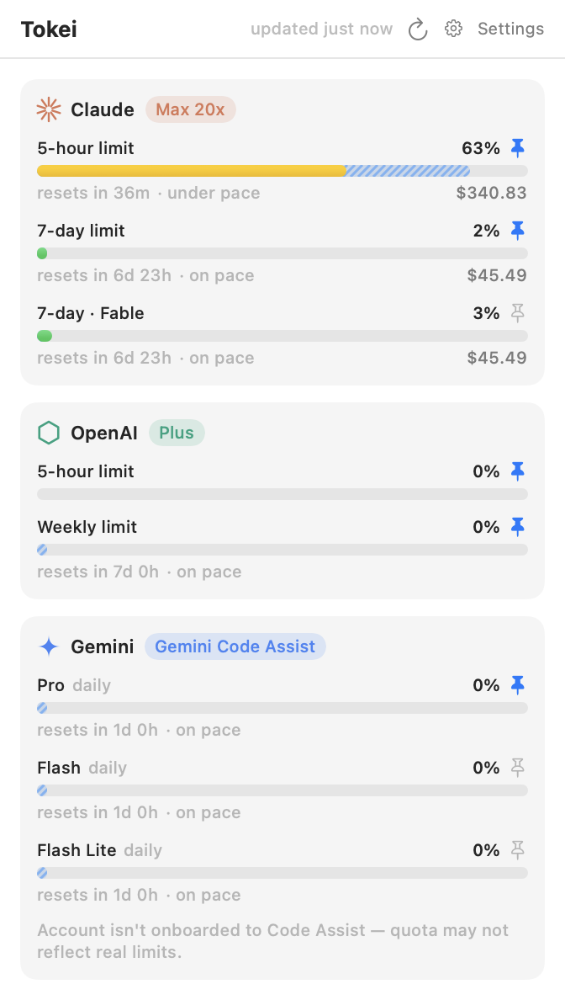
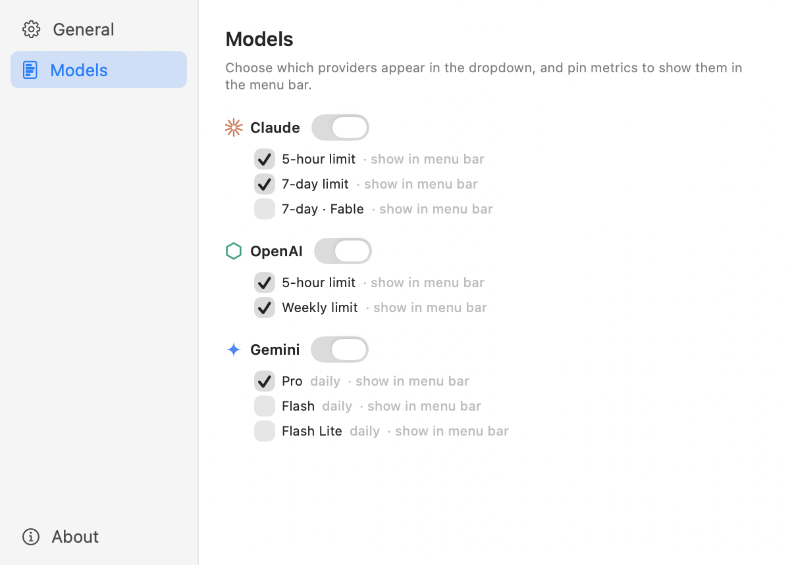

<div align="center">

<picture>
  <source media="(prefers-color-scheme: dark)" srcset="Assets/tokei-lockup-reverse-512h.png">
  
</picture>

### Your AI subscription limits, live in the macOS menu bar.

**Tokei** (時計 — Japanese for *clock/meter*) is like iStat Menus, but for your Claude, OpenAI, and Gemini rate limits.


<picture>
  <source media="(prefers-color-scheme: dark)" srcset="Assets/screenshots/menubar-dark.png">
  
</picture>

<br>

<picture>
  <source media="(prefers-color-scheme: dark)" srcset="Assets/screenshots/popover-dark.png">
  
</picture>

</div>

---

Tokei reads the credentials your local CLIs are already signed in with — no API keys, no extra logins — and shows live usage for:

| Provider | Metrics | Source |
|---|---|---|
| **Claude** (Anthropic) | 5-hour and 7-day limits, model-scoped weekly limits (e.g. Fable), and the dollar value of inference used per window | Claude Code's OAuth token → the same endpoint as `/usage`, plus local transcript pricing |
| **OpenAI** (Codex) | Weekly rate-limit window, plan, credits | `~/.codex/auth.json` → the endpoint behind Codex's `/status` |
| **Gemini** (Google) | Per-tier daily quota (Pro / Flash / Flash Lite) | `~/.gemini/oauth_creds.json` → Code Assist quota API |

Everything runs locally. Tokens are read from where the CLIs store them, requests go directly to each provider, and nothing is logged or sent anywhere else.

## Features

- **Menu bar readout** — each provider appears as its logo glyph with its pinned percentages, e.g. `✳ 63·2%  ⬡ 0·0%  ✦ 0%`. Pin or unpin any metric; unpin everything for an icon-only look. ⌘-drag to reposition.
- **Dashboard popover** — per-provider cards with color-coded usage bars (green → yellow → orange → red), plan badges (Max 20x, Plus, …), and live "resets in 2h 38m" countdowns.
- **Pace indicator** — a hatched blue segment inside each bar marks where usage would sit if burned evenly until reset, with an "ahead of / on / under pace" note beside the countdown. Toggleable in Settings.
- **Inference dollars (Claude)** — each window shows the API-equivalent dollar value of the inference used in it (e.g. `$340.83`), priced from Claude Code's local transcripts at current per-model rates, including cache-write and cache-read pricing.
- **Stable windows** — Claude always shows its 5-hour and 7-day windows, and OpenAI its weekly window (an unreported window means 0% used). Gemini shows daily windows — the only kind Google's quota API has.
- **Settings window** — General (open at login, refresh interval, pace toggle, updates), Models (provider visibility and menu-bar pins in one place), About.
- **In-app updates** — Tokei checks GitHub Releases twice a day (and via Settings → Check for Updates); when a new version ships, a banner appears in the popover and one click downloads, installs, and relaunches. Releases are signed and notarized.
- **Auto-refresh** — every 1/5/15/30 minutes plus refresh-on-open. Transient failures (including provider rate limits) keep the last good data on screen, and failed fetches retry automatically.

<div align="center">
<picture>
  <source media="(prefers-color-scheme: dark)" srcset="Assets/screenshots/settings-dark.png">
  
</picture>
</div>

## Install

### From a release

1. Download the latest `Tokei-x.y.z.dmg` from [Releases](../../releases).
2. Open it and drag **Tokei** into **Applications** — releases are notarized, so it opens without warnings.
3. If macOS asks for permission to read the **"Claude Code-credentials"** keychain item, click **Always Allow**.

### From source

Requires macOS 14+ and Xcode (Swift 5.9+).

```sh
git clone https://github.com/zachgodsell93/tokei.git tokei
cd tokei
make install        # builds Tokei.app, copies it to /Applications, and opens it
```

Other targets:

```sh
make check          # headless test: prints live usage for every connected provider
make dmg            # build the distributable disk image
make test           # unit tests
make run            # run the debug build without installing
```

## How it gets your usage

- **Claude** — Claude Code stores an OAuth token in the macOS Keychain (with `~/.claude/.credentials.json` as fallback). Tokei calls Anthropic's OAuth usage endpoint — the same one behind Claude Code's `/usage` — for 5-hour/7-day utilization, reset times, and model-scoped limits. Tokei never refreshes this token itself; if it expires, open Claude Code once.
- **Claude inference dollars** — subscription plans aren't billed per token, so Tokei computes the *API-equivalent value*: Claude Code logs every message's token usage to `~/.claude/projects/**/*.jsonl`, and Tokei prices those tokens at current API rates (input/output per model, cache writes at 1.25×/2× input for 5m/1h TTL, cache reads at 0.1×), summed per window. It measures this Mac's transcripts — usage from other devices or claude.ai isn't counted.
- **OpenAI** — the Codex CLI stores ChatGPT OAuth tokens in `~/.codex/auth.json`. Tokei calls the usage endpoint behind Codex's `/status`. Codex refresh tokens rotate server-side, so Tokei deliberately never refreshes them (that could log the CLI out) — run any `codex` command if the token expires.
- **Gemini** — the Gemini CLI stores Google OAuth credentials in `~/.gemini/oauth_creds.json`. Hourly access tokens are refreshed in memory using the CLI's own public OAuth client (read from your local gemini-cli install); nothing is written back. Quota comes from the Code Assist `retrieveUserQuota` endpoint.

## Privacy & safety

- Read-only: never writes to any CLI's credential store.
- Tokens never leave your machine except to the provider that issued them.
- No analytics, no third-party services. A local debug log of fetch outcomes (no tokens) is kept at `~/Library/Caches/Tokei.log`.

## Troubleshooting

- **Claude shows "token expired"** — open Claude Code (`claude`) once; the next poll picks up the refreshed token.
- **Claude shows "rate-limited"** — Anthropic briefly rate-limits the usage endpoint after many requests; it recovers on its own.
- **OpenAI shows "not connected"** — run `codex login`.
- **Gemini shows "sign-in expired"** — run `gemini` and complete the Google login.
- **Gemini reads 0% forever** — consumer Google accounts lost Gemini CLI access in June 2026; Tokei flags this ("not onboarded to Code Assist"). Code Assist Standard/Enterprise accounts report real usage.
- **No dollar figures on Claude rows** — they appear only when Claude Code transcripts exist on this Mac for the current window.
- **Can't find the menu bar item** — a crowded menu bar (many status items) can push items into macOS's hidden overflow. Remove/rearrange items (⌘-drag) to make room; Tokei requests a slot near the system icons on first launch.

## Releasing (maintainers)

Bump `CFBundleShortVersionString` in `scripts/Info.plist`, then tag and push — GitHub Actions tests, signs, notarizes, and publishes the DMG:

```sh
git tag v1.5.0 && git push origin v1.5.0
```

Signing + notarization activate automatically when these repo secrets exist (Settings → Secrets and variables → Actions, or `gh secret set`):

| Secret | Value |
|---|---|
| `MACOS_CERT_P12` | Base64 of the exported "Developer ID Application" certificate (`base64 -i cert.p12`) |
| `MACOS_CERT_P12_PASSWORD` | The password chosen when exporting the .p12 |
| `APPLE_ID` | Apple ID email of the developer account |
| `APPLE_TEAM_ID` | 10-character Team ID (developer.apple.com → Membership) |
| `APPLE_APP_SPECIFIC_PASSWORD` | App-specific password from account.apple.com → Sign-In & Security |

Without the secrets the workflow falls back to an ad-hoc signed build (right-click → Open required).

## Development

```sh
swift build && swift test
.build/debug/Tokei --check                        # live end-to-end fetch, no UI
.build/debug/Tokei --render-popover out.png       # render the popover to a PNG
.build/debug/Tokei --render-label out.png dark    # render the menu bar label (light|dark)
open build/Tokei.app --args --self-test /tmp/st --demo   # live-app self-test: window snapshots in both appearances
```

Sources live under `Sources/Tokei/`:

- `Services/` — one client per provider, the polling `UsageStore`, the local cost calculator, and the update checker/installer
- `Views/` — popover dashboard, settings window, provider logos, menu bar label
- `Support/` — HTTP/JSON helpers, timeout/timestamp utilities, Keychain access
